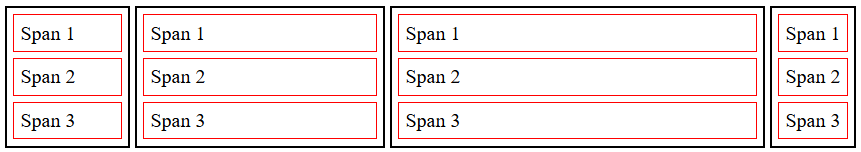

# Day 04 – CSS Box Model & Display Property

## Objective

Practice using the **CSS box model** and **display property** to create responsive, nested content. Apply **BEM-style class naming** to control sizes and layouts of elements.

## Preview

## Project Files

- [index.html](./index.html) – Contains `
` elements with nested ``s and BEM-style classes for sizing.  
- [style.css](./style.css) – Contains box-sizing, borders, widths, and display property styles.  
- [README.md](./README.md) – This file.

## Layout Details

- **Paragraphs (`
` with `.box`)**
  - Display: `inline-block`  
  - Border: `2px solid black`  
  - Sized using modifier classes:
    - `.box--small` → 100px  
    - `.box--medium` → 200px  
    - `.box--large` → 300px  
    - `.box--extra-large` → 400px
- **Nested spans (``)**
  - Display: `block`  
  - Border: `1px solid red`  
  - Margin & padding: 5px
- **BEM Naming Conventions Used**
  - Block: `.box`  
  - Modifiers: `.box--small`, `.box--medium`, `.box--large`, `.box--extra-large`

- Flexibility & responsiveness tested by changing widths and nesting spans inside the paragraphs.

## How to View

1. Fork or clone this repository.  
2. Open [index.html](./index.html) in a browser.  
3. Inspect elements to see box-sizing, borders, display styles, and BEM naming.

## Key Learnings

- Understanding the **CSS box model** (content, padding, border, margin)  
- Using **display properties** (`block`, `inline-block`) to control layout  
- Applying **BEM naming conventions** for reusable styles  
- Nesting elements to observe inheritance and sizing  
- Practicing fixed sizing and responsive adjustments with CSS units

## Resources

- [MDN: CSS Box Model](https://developer.mozilla.org/en-US/docs/Learn/CSS/Building_blocks/The_box_model)  
- [MDN: CSS Display](https://developer.mozilla.org/en-US/docs/Web/CSS/display)  
- [CSS-Tricks: Box Sizing](https://css-tricks.com/box-sizing/)  

[Back to Day 04 README](/day-04/README.md)