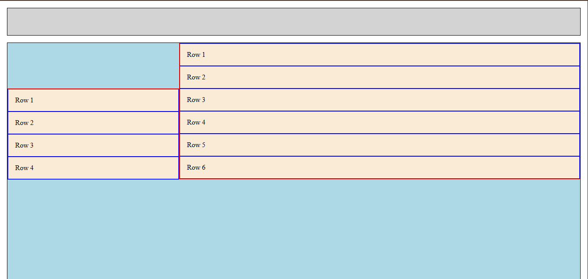

# CSS Units & Layout

## Objective

Recreate a responsive two-column layout using **CSS units** (`%`, `em`, `rem`, `vh`, `vw`, `px`) and a predictable **BEM-style class naming strategy**. Practice **Flexbox**, nested containers, and dynamic sizing with `calc()`.

## Preview

## Project Files

- [index.html](./index.html) – Main HTML file with `#header`, `#body`, `.col`, and `.row` elements.  
- [style.css](./style.css) – Contains CSS units, Flexbox layout, borders, and padding.  
- [README.md](./READme.md) – This file.

## Layout Details

- **Header (`#header`)**  
  - Height: `10vh`  
  - Background: `lightgrey`  
  - Border: `1px solid black`
- **Body (`#body`)**  
  - Height: `calc(100vh - 10vh)`  
  - Background: `lightblue`  
  - Border: `1px solid black`
- **Columns (`.col`)**  
  - Column 1 (`#col-1`) – 30% width, 4 nested `.row` elements  
  - Column 2 (`#col-2`) – 70% width, 6 nested `.row` elements  
  - Background: `antiquewhite`  
  - Border: `1px solid red`  
  - Padding: `1em`
- **Rows (`.row`)**  
  - Width: 100%  
  - Border: `1px solid blue`  
  - Padding: equal to parent container font size
- Flexbox utilities used:
  - `.flex-contaner` → `display: flex`  
  - `.flex--column` → `flex-direction: column`  
  - `gap` and padding manage spacing between elements

## How to View

1. Fork or clone this repository.  
2. Open [index.html](./index.html) in a browser.  
3. Inspect elements to see CSS units, Flexbox layout, and BEM naming.

## Key Learnings

- Using **CSS units** (`em`, `rem`, `%`, `vh`, `vw`, `px`) for responsive layouts  
- Building **nested column/row layouts** with Flexbox  
- Using `calc()` to combine units for dynamic sizing  
- Applying **consistent spacing** with padding and borders  
- Practicing **BEM naming** for maintainable CSS

## Resources

- [CSS-Tricks: Flexbox Guide](https://css-tricks.com/snippets/css/a-guide-to-flexbox/)  
- [MDN: CSS Flexible Box Layout](https://developer.mozilla.org/en-US/docs/Web/CSS/CSS_Flexible_Box_Layout)  
- [MDN: CSS Values and Units](https://developer.mozilla.org/en-US/docs/Learn/CSS/Building_blocks/Values_and_units)

[Back to Day 05 README](/day-05/README.md)