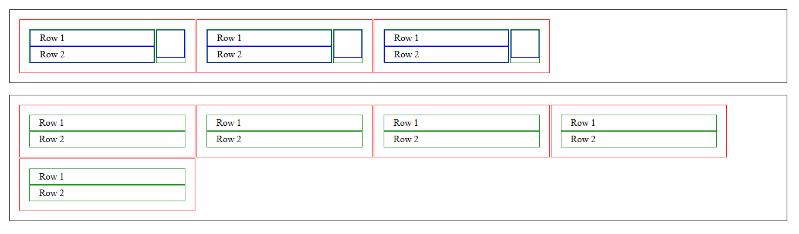

# Cards Layout with BEM

## Objective

Recreate a cards layout using **BEM naming conventions**, proper spacing, and colored borders. Practice using **Flexbox**, nested containers, and sizing rules.

## Preview

## Project Files

- [index.html](./index.html) – Main HTML file with `.cards` and `.card` elements.
- [style.css](./style.css) – Contains BEM-based styling, borders, padding, and flex layout.
- [README.md](./README.md) – This file.

## BEM Naming Conventions Used

- Block: `.cards`, `.card`
- Elements: `.card__title`, `.card__description`, `.card__icon`, `.card__content`
- Modifiers: `.border--red`, `.border--green`, `.border--blue`, `.last__cards`

## Layout Details

- Each `.card` is **300px wide**.
- All `.cards` and `.card` containers have **1em padding**.
- `.card__title` and `.card__description` have **0.25em 1em padding**.
- Default borders are **1px solid black**, with color modifiers applied as needed.
- Flexbox is used for layout:
  - `.flexbox` for horizontal wrapping
  - `.flexbox--column` for vertical stacking
  - Gap between cards is `2px`
- Special case in the first `.cards` container:
  - First `.card` has **two green `.card__content` boxes**
  - The second green box contains a **blue `.card__icon` sized 48px × 48px**
- The last `.cards` container has **`margin-top: 1rem`**.

## How to View

1. Fork or clone this repository.
2. Open [index.html](./index.html) in a browser.
3. Inspect elements to see BEM naming and applied styles.

## Key Learnings

- Using **BEM** for reusable, maintainable CSS
- Creating **nested card layouts** with Flexbox
- Applying **consistent spacing** with padding and gaps
- Using **CSS modifiers** for borders and styling

## Resources

- [CSS-Tricks: Flexbox Guide](https://css-tricks.com/snippets/css/a-guide-to-flexbox/)
- [MDN: CSS Flexbox](https://developer.mozilla.org/en-US/docs/Web/CSS/CSS_Flexible_Box_Layout)
- [Flexbox Froggy](https://flexboxfroggy.com/)

[Back to Day 06 README](/day-06/README.md)