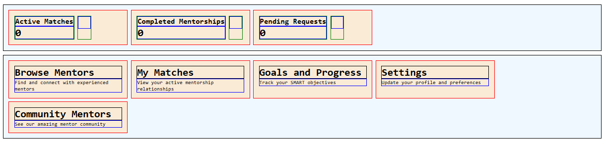

# Day 07 – Mentorship Dashboard

## Objective

Build a mentorship dashboard using **Flexbox** with card-based UI, proper spacing, and responsive layout.

## Layout Preview



## Layout

### Metrics Cards (3 in a row)

| Card                  | Value |
|-----------------------|-------|
| Active Matches        | 0     |
| Completed Mentorships | 0     |
| Pending Requests      | 0     |


_Each card:_ title `1.25em`, value `2em`, icon `32x32px`

### Details Cards (5 cards, flex wrap)

- **Browse Mentors** – Find & connect with experienced mentors
- **My Matches** – Active mentorship relationships
- **Goals & Progress** – Track SMART objectives
- **Settings** – Update profile/preferences
- **Community Mentors** – See mentor community

## Flexbox & Utility Classes

- `.container`, `.container--column`
- `.card`, `.metrics`, `.details`
- `.border`, `.border--red/green/blue`
- `display: flex; flex-direction; flex-wrap; gap; justify-content; align-items`

## CSS Essentials

```css
* {
  margin: 0;
  padding: 0;
  box-sizing: border-box;
}
body {
  font-family: monospace;
}
.card {
  width: 300px;
  background: antiquewhite;
  padding: 1em;
}
.metrics,
.details {
  background: aliceblue;
  padding: 1em;
}
.card__title {
  font-size: 1.25em;
}
.card__value {
  font-size: 2em;
}
.card__icon {
  width: 32px;
  height: 32px;
}
```

## Files

- **HTML:** [index.html](./index.html) – Main dashboard structure  
- **CSS:** [style.css](./style.css) – Flexbox layout, card styling, and utility classes

## Key Learnings


- Row & column layouts with Flexbox
- Nested containers for card content
- Consistent spacing with `gap` & padding
- Semantic HTML + reusable utility classes


## Resources

- [CSS-Tricks: Flexbox Guide](https://css-tricks.com/snippets/css/a-guide-to-flexbox/)
- [MDN: Flexbox](https://developer.mozilla.org/en-US/docs/Web/CSS/CSS_Flexible_Box_Layout)
- [Flexbox Froggy](https://flexboxfroggy.com/)

[Back to Day 07 README](/day-07/README.md)
