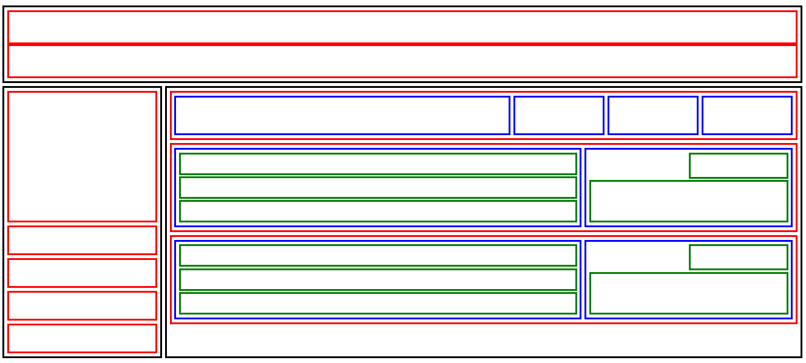

# Day 08 – Flexbox Layout

## Overview

This project recreates a multi-section layout using **CSS Flexbox**.  
The goal was to practice building structured layouts with **rows, columns, and nested flex containers**.

The page includes a **header**, **sidebar navigation**, and a **main content area** containing card-based layouts.


## Layout Preview




## Project Structure

```bash
day-08/submissions/hadiashah01/
│
├── day-08-submissions.png
├── index.html
├── style.css
└── README.md
```


## Flexbox Concepts Used        

- `display: flex`
- `flex-direction`
- `justify-content`
- `align-items`
- `gap`
- `flex-grow`
- nested flex containers


## Utility Classes

Flexbox utility classes used in the layout:  
- `.flex--row`      
- `.flex--column`  
- `.border`  
- `.border--red`  
- `.border--blue`  
- `.border--green`


## CSS Reset

```css
* {
  margin: 0;
  padding: 0;
  box-sizing: border-box;
}
```

## Key Learning

- Building layouts using **Flexbox**
- Creating **nested flex containers**
- Controlling layout sizing using `flex`
- Managing spacing using `gap`
- Using reusable **utility classes**

---

## Resources

- **CSS Tricks – Flexbox Guide**  
  https://css-tricks.com/snippets/css/a-guide-to-flexbox/

- **MDN Flexbox Documentation**  
  https://developer.mozilla.org/en-US/docs/Web/CSS/CSS_Flexible_Box_Layout

- **Flexbox Froggy**  
  https://flexboxfroggy.com/